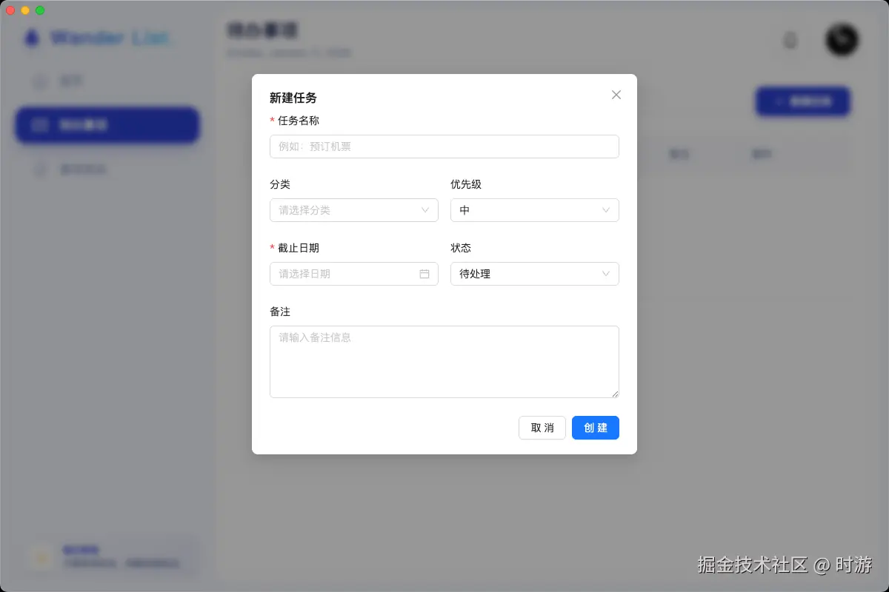
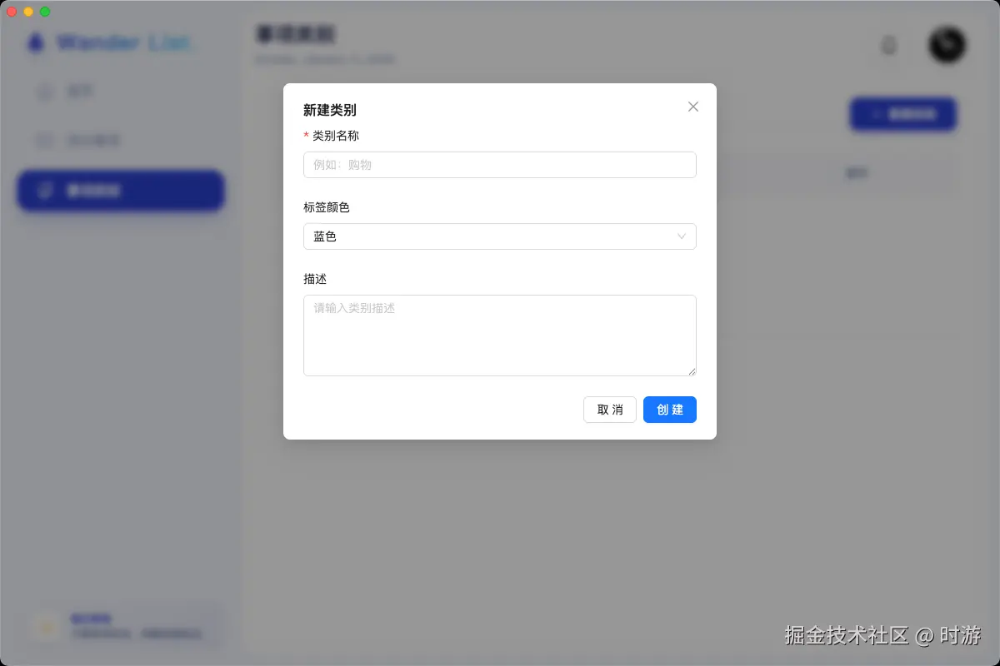

# ✈️ WanderList

<div align="center">

> 您的智能待办清单助手，让工作与生活井井有条

[](https://reactjs.org/)
[](https://www.electronjs.org/)
[](https://nodejs.org/)
[](https://www.mysql.com/)
[](https://ant.design/)

</div>

---

## 📖 项目介绍

WanderList 这是一个基于 **React**、**Redux**、**React Router**、**Antd** 组件库和 **Electron** 的现代化待办清单项目，提供桌面端及浏览器端入口。

主体功能包含待办事项的添加、删除、编辑、标记完成等操作，同时支持任务分类、搜索、排序等功能。系统支持用户自定义配色方案，用户可以根据个人喜好自定义系统的外观。

## 📸 项目预览

<div align="center">
  
  
</div>

<div align="center">
  
  
  
</div>

## ✨ 功能清单

1.  **👤 用户系统**
    *   用户登录、注册（支持手机号+密码，验证码登录）
2.  **📂 事项类别管理**
    *   内置预置类别
    *   自定义添加、删除、编辑类别
3.  **✅ 待办事项管理**
    *   添加、删除、编辑待办事项
    *   标记完成状态
    *   支持按优先级、时间排序
4.  **📊 数据统计**
    *   可视化仪表盘
    *   统计待办总数、已完成/未完成数、分类占比
5.  **🎨 个性化**
    *   用户自定义配色方案

## 🛠️ 技术栈

### 前端 (Frontend)
*   **React** - 构建用户界面的 JavaScript 库
*   **Redux** - 状态容器，提供可预测的状态管理
*   **React Router** - 声明式路由管理
*   **Ant Design** - 企业级 UI 设计语言和 React 组件库
*   **Electron** - 使用 Web 技术构建跨平台桌面应用

### 后端 (Backend)
*   **Node.js** - 基于 Chrome V8 引擎的 JavaScript 运行环境
*   **Express** - 快速、开放、极简的 Web 开发框架
*   **MySQL** - 关系型数据库管理系统

## 🚀 快速开始

### 1. 环境准备
请确保您的本地环境已安装以下工具：
*   [Node.js](https://nodejs.org/)
*   [MySQL](https://www.mysql.com/)

### 2. 数据库配置
1.  创建一个新的 MySQL 数据库（例如 `travel_todo_list`）。
2.  将 `travel-todo-list-ba/travel_todo_list.sql` 导入到数据库中。
3.  进入后端目录 `travel-todo-list-ba`，创建一个 `.env` 文件（参考 `src/config/db.js`），配置数据库连接信息：

```env
DB_HOST=localhost
DB_USER=root
DB_PASSWORD=your_password
DB_NAME=travel_todo_list
```

### 3. 启动后端
```bash
cd travel-todo-list-ba
npm install
npm run dev
```

### 4. 启动前端

**Web 端开发模式：**
```bash
cd travel-todo-list-fe
npm install
npm run dev
```

**Electron 桌面端开发模式：**
```bash
cd travel-todo-list-fe
npm run electron:dev
```

## 🔗 开源地址
[https://github.com/xktx-0915/wander-todo-list.git](https://github.com/xktx-0915/wander-todo-list.git)
